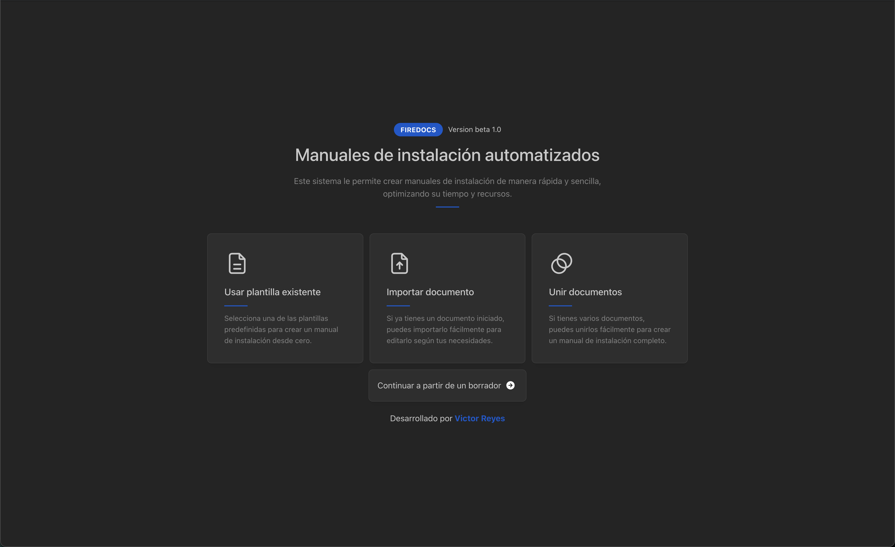
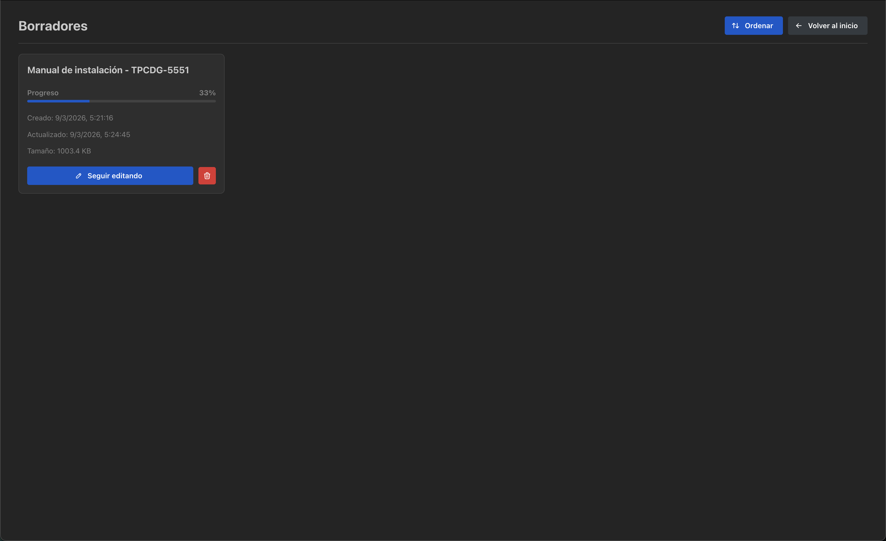
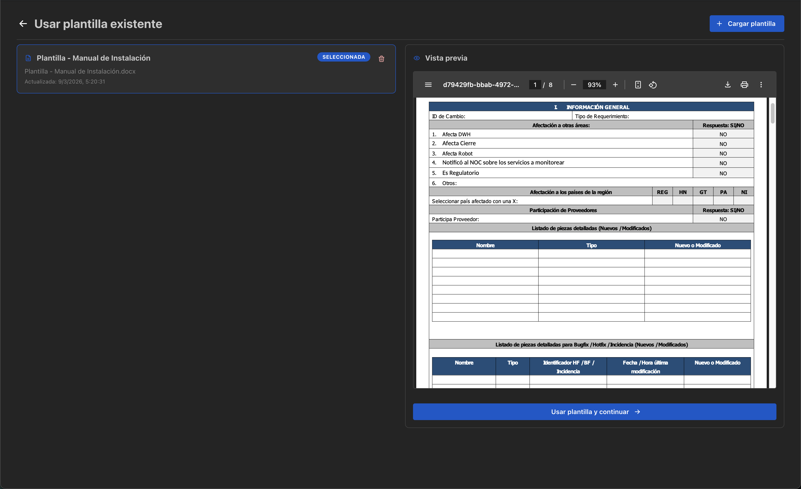
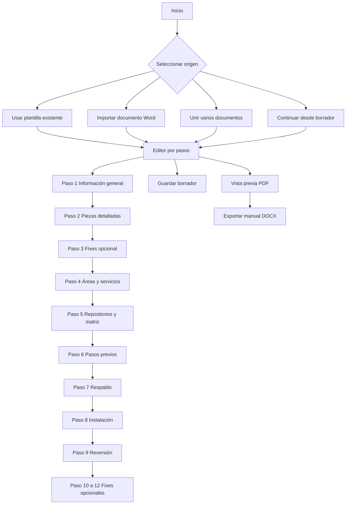

# Firedocs

Aplicación de escritorio construida con Electron, React, TypeScript y Vite para crear manuales de instalación a partir de documentos Word, plantillas reutilizables, cambios de repositorios Git y edición guiada por pasos.

## Qué hace este software

Firedocs permite tomar un manual existente en formato `.docx` o una plantilla base, extraer su estructura y convertirla en un flujo editable dentro de la aplicación. A partir de ahí, el usuario puede completar o corregir la información necesaria para generar un manual técnico actualizado.

### Capacidades principales

- Importa un manual Word existente y extrae su contenido editable
- Une varios manuales en uno solo, siempre que pertenezcan a la misma iniciativa y compartan la misma información general
- Permite crear manuales nuevos desde plantillas guardadas dentro de la aplicación
- Guarda borradores persistentes para retomar el trabajo después
- Genera vista previa en PDF del manual antes de exportarlo
- Exporta el manual final en formato `.docx`
- Construye tablas de piezas detalladas a partir de repositorios Git
- Permite cargar cambios desde el estado actual del repositorio o desde un commit específico
- Genera tablas de instalación, reversión y respaldo tanto para flujo normal como para Bugfix/Hotfix
- Mantiene una matriz de comunicación y datos auxiliares usados dentro del documento final

## Flujo funcional del sistema

La aplicación está pensada para trabajar en un flujo de edición guiado.

## Capturas de pantalla

### Pantalla principal



### Gestión de borradores



### Vista previa del manual



## Diagrama del flujo de uso



### Inicio

Desde la pantalla principal el usuario puede:

- Usar una plantilla existente
- Importar un documento Word ya iniciado
- Unir varios documentos Word en un solo manual
- Continuar desde un borrador existente

### Edición por pasos

Una vez cargado el manual, Firedocs habilita un editor por pasos:

1. Información general
2. Piezas detalladas
3. Piezas detalladas para Bugfix, Hotfix e incidencias
4. Áreas afectadas y servicios relacionados
5. Repositorios y matriz de comunicación
6. Pasos previos
7. Respaldo de objetos
8. Pasos de instalación
9. Pasos de reversión
10. Respaldo para Bugfix/Hotfix
11. Instalación para Bugfix/Hotfix
12. Reversión para Bugfix/Hotfix

Los pasos 3, 10, 11 y 12 están ocultos por defecto y se habilitan al activar la opción de flujo Bugfix/Hotfix.

### Plantillas

Las plantillas son documentos base guardados por la aplicación con extensión `.fd`. Cada plantilla almacena:

- Nombre visible
- Nombre original del archivo fuente
- Fechas de creación y actualización
- Contenido del `.docx` en base64

Desde la pantalla de plantillas el usuario puede:

- Importar una nueva plantilla Word
- Ver una vista previa PDF de la plantilla
- Cargar una plantilla como base de trabajo
- Eliminar plantillas guardadas

### Borradores

Los borradores se almacenan con extensión `.fdd` e incluyen todo el estado del manual:

- Título
- Paso activo
- Pasos visibles
- Información general
- Tablas de piezas, respaldo, instalación y reversión
- Datos de servicios, áreas, repositorios y matriz de comunicación
- HTML de pasos previos
- Plantilla base asociada

### Integración con Git

En el paso de piezas detalladas se puede construir una tabla desde Git:

- Seleccionando uno o varios repositorios
- Escaneando el estado actual del working tree
- Cargando cambios a partir de un commit específico
- Obteniendo la fecha de última modificación desde Git para fixes

La aplicación clasifica automáticamente tipos de archivo a partir de su extensión. Por ejemplo:

- `.xq` y `.xqy` se convierten en `XQUERY`
- `.biz` se convierte en `BUSINESS`

### Vista previa y exportación

Firedocs genera una vista previa PDF del manual final antes de exportarlo. La exportación final genera un archivo `.docx`.

Importante:

- La vista previa PDF depende de LibreOffice
- La exportación del `.docx` no depende de LibreOffice

## Requisitos para ejecutar el proyecto

### Requisitos generales

- Node.js 20 o superior
- npm 10 o superior
- Git instalado en el sistema para desarrollo local con integración Git
- LibreOffice instalado si se desea usar vista previa PDF de plantillas o manuales

### Requisitos por sistema operativo

#### macOS

- Recomendado para desarrollo local actual del proyecto
- LibreOffice suele resolverse automáticamente en `/Applications/LibreOffice.app/Contents/MacOS/soffice`

#### Windows

- Para desarrollo, la app puede usar Git del sistema
- Para generar el paquete distribuible de Windows, el build descarga y prepara Portable Git automáticamente
- La distribución Windows actual está configurada como `.zip`

#### Linux

- Soportado para empaquetado mediante `AppImage`
- Se requiere `soffice` o `libreoffice` accesible desde PATH para la vista previa

## Variables de entorno opcionales

No existe un archivo `.env` obligatorio para ejecutar la aplicación, pero sí hay variables opcionales útiles:

- `FIREDOCS_LIBREOFFICE_PATH`
  Define una ruta específica al binario de LibreOffice

- `FIREDOCS_GIT_PATH`
  Define una ruta específica al binario de Git

- `PORTABLE_GIT_URL`
  Permite cambiar la URL usada por el script que descarga Portable Git al empaquetar Windows

## Instalación del proyecto

```bash
npm install
```

## Ejecución en desarrollo

```bash
npm run dev
```

Este comando levanta simultáneamente:

- Vite para el renderer React
- TypeScript en modo watch para el proceso principal de Electron
- La aplicación Electron en modo desarrollo

## Otros scripts disponibles

### Compilar renderer

```bash
npm run build
```

### Ejecutar ESLint

```bash
npm run lint
```

### Previsualizar el build web

```bash
npm run preview
```

### Empaquetar macOS

```bash
npm run dist:mac
```

### Generar app macOS sin instalador

```bash
npm run dist:mac:app
```

### Ejecutar la app macOS generada

```bash
npm run run:mac:app
```

### Empaquetar Windows

```bash
npm run dist:win
```

Este flujo hace lo siguiente:

1. Descarga Portable Git si no existe en `vendor/portable-git/windows`
2. Compila Electron
3. Compila el renderer
4. Genera el artefacto Windows en formato `.zip`

### Empaquetar Linux

```bash
npm run dist:linux
```

## Estructura técnica del proyecto

### Renderer

La interfaz está construida con:

- React 19
- React Router
- Mantine
- Tiptap

Rutas principales:

- `/` inicio
- `/templates` plantillas
- `/drafts` borradores
- `/import` editor por pasos
- `/editor` editor por pasos
- `/preview` vista previa del manual

La app usa `HashRouter` cuando se ejecuta desde archivo empaquetado y `BrowserRouter` en desarrollo.

### Proceso principal de Electron

El proceso principal se encarga de:

- Crear la ventana principal
- Abrir selectores de archivos y carpetas
- Guardar `.docx`
- Convertir `.docx` a PDF para vista previa usando LibreOffice
- Leer y escribir plantillas `.fd`
- Leer y escribir borradores `.fdd`
- Escanear repositorios Git
- Consultar cambios por commit
- Obtener última fecha de modificación por archivo

### Persistencia

En modo empaquetado:

- Las plantillas se guardan en `userData/templates`
- Los borradores se guardan en `userData/drafts`

En desarrollo:

- Las plantillas se guardan en `./templates`
- Los borradores se guardan en `./drafts`

## Dependencias externas relevantes

### LibreOffice

Se usa para:

- Vista previa PDF del manual actual
- Vista previa PDF de plantillas guardadas

Si LibreOffice no está disponible, la aplicación seguirá funcionando para edición y exportación `.docx`, pero no podrá generar las vistas previas PDF.

### Git

Se usa para:

- Escanear cambios de repositorios
- Detectar piezas afectadas
- Cargar cambios desde un commit específico
- Obtener fechas de modificación para fixes

## Consideraciones importantes

- El proyecto está orientado a escritorio, no a despliegue web puro
- El empaquetado de Windows está configurado para distribuirse como `.zip`
- El flujo de pasos depende de una plantilla o documento base válido
- La calidad de extracción del contenido depende de la estructura del `.docx` importado

## Solución de problemas

### No se genera la vista previa PDF

Verifica que LibreOffice esté instalado y accesible. Si no está en la ruta estándar del sistema, configura `FIREDOCS_LIBREOFFICE_PATH`.

### No se detectan cambios de Git

Verifica que:

- El repositorio tenga carpeta `.git`
- Git esté instalado o accesible
- Si estás en Windows empaquetado, el paquete incluya Portable Git correctamente

### El build de Windows falla preparando Git

Revisa conectividad de red o define `PORTABLE_GIT_URL` con un origen válido del instalador de Portable Git.

## Estado actual

Firedocs es una herramienta de escritorio enfocada en acelerar la creación de manuales técnicos de instalación con soporte para:

- Plantillas
- Borradores
- Importación y unión de manuales
- Integración con Git
- Vista previa PDF
- Exportación final en Word
